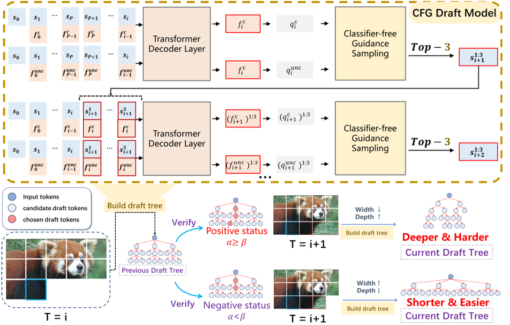

# ADT-Tree: Fast Inference of Visual Autoregressive Model

This repository is an official PyTorch implementation of the paper [Fast Inference of Visual Autoregressive Model with Adjacency-Adaptive Dynamical Draft Trees](https://arxiv.org/abs/2512.21857).

All main code refers to the project [LANTERN](https://github.com/jadohu/LANTERN)

Thank the LANTERN team for their contributions to the open-source community

---

## 📰 News

- **[2025-11-28] TODO: Change the eagle tree**
- **[2025-11-20] 🎉🎉🎉 Our ADT-Tree is released! 🎉🎉🎉**
- **Paper Portal for Top Conferences in the Field of Artificial intelligence: [CV_Paper_Portal](https://hongsong-wang.github.io/CV_Paper_Portal/)**

---

## Method and Performance



Below is a comparison of the effects of different methods


---

## ⚙️ Installation

1. **Install Required Packages**
    **Requirements**
    - Python >= 3.10
    - PyTorch >= 2.4.0
    
    Install the dependencies listed in `requirements.txt`.
    ```bash
    git clone https://github.com/Haodong-Lei-Ray/PEANUT.git
    cd PEANUT
    conda create -n PEANUT python=3.10 -y
    conda activate PEANUT
    pip install -r requirements.txt
    ```

2. **Additional Setup**
    1. **Lumina-mGPT**
        For [Lumina-mGPT](https://github.com/Alpha-VLLM/Lumina-mGPT), we need to install `flash_attention` and `xllmx` packages.
        ```bash
        pip install flash-attn --no-build-isolation
        cd models/base_models/lumina_mgpt
        pip install -e .
        ```

3. **Checkpoints**
    All model weights and other required data should be stored in `ckpts/`.
    1. **Lumina-mGPT**
        For Lumina-mGPT, since currently the Chameleon implementation in transformers does not contain the VQ-VAE decoder, please manually download the original VQ-VAE weights [provided by Meta](https://github.com/facebookresearch/chameleon) and put them to the following directory:
        ```
        ckpts
        └── lumina_mgpt
            └── chameleon
                └── tokenizer
                    ├── text_tokenizer.json
                    ├── vqgan.yaml
                    └── vqgan.ckpt
        ```

        Also download the original model [`Lumina-mGPT-7B-768`](https://huggingface.co/Alpha-VLLM/Lumina-mGPT-7B-768) from Huggingface 🤗 and put them to the following directory:
        ```
        ckpts
        └── lumina_mgpt
            └── Lumina-mGPT-7B-768
                ├── config.json
                ├── generation_config.json
                ├── model-00001-of-00002.safetensors
                └── other files...
        ```
    2. **Anole**
        For Anole, download [`Anole-7b-v0.1-hf`](https://huggingface.co/leloy/Anole-7b-v0.1-hf), which is a huggingface style converted model from [`Anole`](https://huggingface.co/GAIR/Anole-7b-v0.1). 
        
        In addition, you should download the original VQ-VAE weights [provided by Meta](https://github.com/facebookresearch/chameleon) and put them to the following directory:

        ```
        ckpts
        └── anole
            ├── Anole-7b-v0.1-hf
            |   ├── config.json
            |   ├── generation_config.json
            |   ├── model-00001-of-00003.safetensors
            |   └── other files...
            └── chameleon
                └── tokenizer
                    ├── text_tokenizer.json
                    ├── vqgan.yaml
                    └── vqgan.ckpt
        ```

        **(Optional) Trained drafter**
        To use trained drafter, you need to download [`anole_drafter`](https://huggingface.co/jadohu/anole_drafter) and save it under trained_drafters directory.
        ```
        ckpts
        └── anole
            └── trained_drafters
                └── anole_drafter
                    ├── config.json
                    ├── generation_config.json
                    ├── pytorch_model.bin
                    └── other files...
        ```

---

## ✨ Usage

### ANOLE
PEANUT+LANTERN in MSCOCO2017Val
```
cd ./PEANUT
prompt=MSCOCO2017Val
model=anole
temperature=1
model_type=eagle
lantern_delta=0.5
lantern_k=100

#output_path=/home/leihaodong/TIP26/exp/Anole/MSCOCO2017Val/lantern_peanut
output_path=<your out path>

mkdir -p ${output_path}

nohup python main.py generate_images \
 --prompt $prompt \
 --model $model \
 --temperature $temperature \
 --model_type $model_type \
 --model_path leloy/Anole-7b-v0.1-hf \
 --drafter_path jadohu/anole_drafter \
 --output_dir $output_path \
 --lantern \
 --peanut \
 --lantern_k $lantern_k \
 --lantern_delta ${lantern_delta} \
 --num_images -1 > ${output_path}.log 2>&1 &

```


PEANUT+LANTERN


## ⚖️ License

This project is distributed under the Chameleon License by Meta Platforms, Inc. For more information, please see the `LICENSE` file in the repository.

---

## 🙏 Acknowledgement
This repository is built with extensive reference to [FoundationVision/LlamaGen](https://github.com/FoundationVision/LlamaGen), [Alpha-VLLM/Lumina-mGPT](https://github.com/Alpha-VLLM/Lumina-mGPT) and [SafeAILab/EAGLE](https://github.com/SafeAILab/EAGLE), leveraging many of their core components and approaches.


## 📄 Citation

```
@misc{lei2025fastinferencevisualautoregressive,
      title={Fast Inference of Visual Autoregressive Model with Adjacency-Adaptive Dynamical Draft Trees}, 
      author={Haodong Lei and Hongsong Wang and Xin Geng and Liang Wang and Pan Zhou},
      year={2025},
      eprint={2512.21857},
      archivePrefix={arXiv},
      primaryClass={cs.CV},
      url={https://arxiv.org/abs/2512.21857}, 
}

